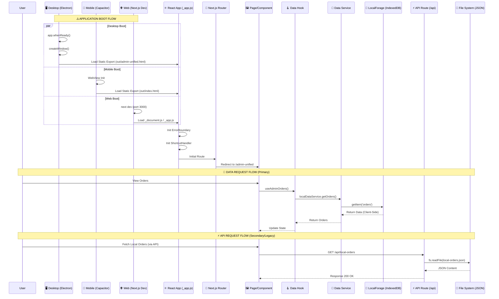

# Phase 1 Architecture Diagrams

> **Generated:** 2026-02-20
> **Based on:** [System Module List](./SYSTEM_MODULE_LIST.md) and [Entry Flow](./ENTRY_FLOW.md)

---

## 1. System Context Map

This diagram visualizes the high-level architecture of the RMS, showing the relationship between the Electron Shell, the Next.js Frontend, and the various business modules and data services.

```mermaid
graph TD
    subgraph "RMS System (Beyon-desk)"
        Electron[🖥️ Electron Shell]
        NextApp[⚛️ Next.js Application]
        
        Electron -->|Wraps| NextApp
        
        subgraph "Core Business Modules"
            Admin[🏪 Admin Panel]
            KOT[🍳 KOT System]
            POS[🛒 Cart & Billing]
            Manual[📝 Manual Orders]
            Offers[🎁 Offers & Promotions]
            Orders[📦 Order Management]
            Menu[🍔 Product / Menu]
        end
        
        subgraph "Infrastructure & Services"
            Auth[🔐 Auth (Basic)]
            DataSvc[📡 Data Services]
            Storage[🗃️ Database & Storage]
            Utils[🛠️ Utilities]
            Shortcuts[⌨️ Keyboard Shortcuts]
        end
        
        NextApp --> Admin
        NextApp --> KOT
        NextApp --> POS
        NextApp --> Manual
        
        Admin --> Offers
        Admin --> Menu
        Admin --> Orders
        
        POS --> Orders
        Manual --> Orders
        KOT --> Orders
        
        Admin -.-> Auth
        
        Admin --> Shortcuts
        POS --> Shortcuts
        
        Orders --> DataSvc
        Menu --> DataSvc
        Offers --> DataSvc
        
        DataSvc --> Storage
    end
    
    style Electron fill:#f9f,stroke:#333,stroke-width:2px
    style NextApp fill:#61dafb,stroke:#333,stroke-width:2px,color:black
    style Storage fill:#f5ea92,stroke:#333,stroke-width:2px
```

---

## 2. Entry Flow & Request Lifecycle

This diagram traces how the application boots up across different platform (Desktop, Mobile, Web) and how data requests are handled, primarily highlighting the client-side nature of the architecture.


